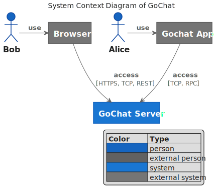
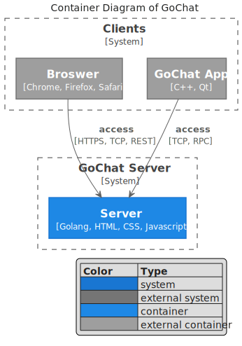
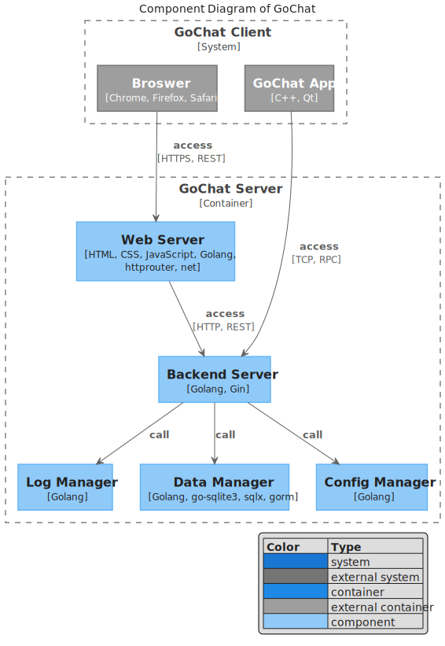

# GoChat Architecture Design Document

## Index

- [1. C4 Mode](#1-c4-mode)
    - [1.1. System Context](#11-system-context)
    - [1.2. Container](#12-container)
    - [1.3. Component](#13-component)
    - [1.4. Code](#14-code)

## 1. C4 Mode

### 1.1. System Context



<!-- ```plantuml
@startuml gochat-system-context

' !include https://unpkg.com/plantuml-style-c4@latest/c4_context.puml
' uncomment the following line and comment the first to use locally
!include plantuml-style-c4/c4_context.puml

LAYOUT_WITH_LEGEND()
' LAYOUT_AS_SKETCH()

title System Context Diagram of GoChat

Actor(user1, "Bob")
Actor(user2, "Alice")

System(gochatserver, "GoChat Server")
System_Ext(broswer, "Browser")
System_Ext(app, "Gochat App")

Rel_Neighbor(user1, broswer, "use")
Rel_Neighbor(user2, app, "use")

Rel(app, gochatserver, "access", "TCP, RPC")
Rel(broswer, gochatserver, "access", "HTTPS, TCP, REST")

@enduml
``` -->

### 1.2. Container



<!-- ```plantuml
@startuml gochat-container

' !include https://unpkg.com/plantuml-style-c4@latest/c4_container.puml
' uncomment the following line and comment the first to use locally
!include plantuml-style-c4/c4_container.puml

LAYOUT_TOP_DOWN
' LAYOUT_AS_SKETCH()
LAYOUT_WITH_LEGEND()

title Container Diagram of GoChat

System_Boundary(gochatserver, "GoChat Server") {
    Container(server, "Server", "Golang, HTML, CSS, Javascript")
}

System_Boundary(clients, "Clients") {
    Container_Ext(broswer, "Broswer", "Chrome, Firefox, Safari")
    Container_Ext(app, "GoChat App", "C++, Qt")
}

Rel(app, server, "access", "TCP, RPC")
Rel(broswer, server, "access", "HTTPS, TCP, REST")

@enduml
``` -->

### 1.3. Component



<!-- ```plantuml
@startuml gochat-component

' !include https://unpkg.com/plantuml-style-c4@latest/c4_component.puml
' uncomment the following line and comment the first to use locally
!include plantuml-style-c4/c4_component.puml

LAYOUT_WITH_LEGEND()
' LAYOUT_AS_SKETCH()

title Component Diagram of GoChat

Container_Boundary(server, "GoChat Server") {
    Component(web, "Web Server", "HTML, CSS, JavaScript, Golang, httprouter, net")
    Component(backend, "Backend Server", "Golang, Gin")
    Component(log, "Log Manager", "Golang")
    Component(data, "Data Manager", "Golang, go-sqlite3, sqlx, gorm")
    Component(conf, "Config Manager", "Golang")

    Rel(web, backend, "access", "HTTP, REST")
    Rel(backend, log, "call")
    Rel(backend, data, "call")
    Rel(backend, conf, "call")
}

System_Boundary(client, "GoChat Client") {
    Container_Ext(broswer, "Broswer", "Chrome, Firefox, Safari")
    Container_Ext(app, "GoChat App", "C++, Qt")
}

Rel(app, backend, "access", "TCP, RPC")
Rel(broswer, web, "access", "HTTPS, REST")

@enduml
``` -->

### 1.4. Code

<!-- ```plantuml
@startuml gochat-code-diagram

' !include https://unpkg.com/plantuml-style-c4@latest/core.puml
' uncomment the following line and comment the first to use locally
!include plantuml-style-c4/core.puml
' !include https://unpkg.com/plantuml-style-c4@latest/class-diagram-helper.puml
' uncomment the following line and comment the first to use locally
!include  plantuml-style-c4/class-diagram-helper.puml

title Code Diagram of GoChat

@enduml
``` -->

---

~~***Unfinished***~~

---

